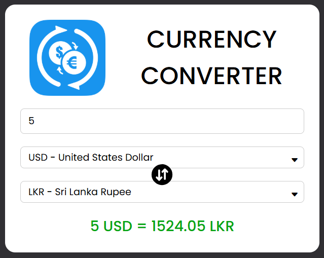

# 💱 Currency Converter

A sleek and modern **Currency Converter Web App** that allows users to convert between different currencies in real-time using live exchange rates.

---

## 🚀 Features

- 🔁 Convert instantly between major world currencies  
- 🌍 Live exchange rates fetched dynamically  
- 💡 Intuitive and responsive user interface  
- 🎨 Minimal and elegant design  
- ⚡ Lightweight and fast performance  

---

## 🧩 Tech Stack

| Technology | Purpose |
|-------------|----------|
| **React.js** | Frontend UI framework |
| **CSS3 / Styled Components** | Custom and responsive styling |
| **JavaScript (ES6+)** | Logic and interactivity |
| **Exchange Rate API** | Live currency data source |

---

## ⚙️ How It Works

1. Enter the amount you want to convert.  
2. Choose your **source currency** and **target currency**.  
3. The app fetches the latest exchange rate via API.  
4. Instantly displays the converted value and rate.  
